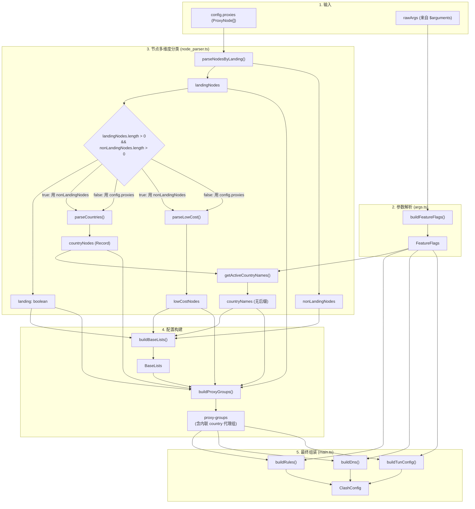

# override-rules 架构文档

本项目是一个 Mihomo/Clash 订阅覆写脚本。它拦截上游订阅配置中的代理节点，按落地/非落地、国家和地区进行多维度分类，并按照预设的规则与策略组将其重组为优化后的 Clash 配置——包含代理组、路由规则、DNS 及 TUN 支持。

---

## 数据流概览

整个覆写脚本的核心流程分为五个阶段：**输入** → **参数解析** → **节点分类** → **配置构建** → **最终组装**。

### 各阶段职责

| 阶段 | 核心模块 | 职责 |
|------|----------|------|
| 输入 | — | 上游订阅传入的代理节点列表 (`config.proxies`) 与用户提供的 URL 覆写参数 (`$arguments`) |
| 参数解析 | `src/args.ts` | 将原始字符串参数转换为类型安全的 `FeatureFlags` 对象，设置各项开关的默认值 |
| 节点分类 | `src/node_parser.ts` | 将节点按三个维度分类：落地/非落地 (`parseNodesByLanding`)、所属国家/地区 (`parseCountries`)、低价节点 (`parseLowCost`)；提取活跃国家名称 (`getActiveCountryNames`) |
| 配置构建 | `src/selectors.ts` + `src/proxy_groups.ts` | 先生成基础代理选择列表 (`BaseLists`)，再基于这些列表和节点分类结果生成完整的代理组定义（国家/地区代理组已内联于 `buildProxyGroups` 中） |
| 最终组装 | `src/main.ts` | 将代理组、路由规则 (`buildRules`)、DNS 配置 (`buildDns`) 与 TUN 配置 (`buildTunConfig`) 拼装为最终输出的 `ClashConfig` |

---

## 文件职责

| 文件 | 职责 | 关键导出 |
|------|------|----------|
| `src/args.ts` | URL 参数解析与默认值处理 | `buildFeatureFlags()`, `parseGroupType()` |
| `src/constants.ts` | 常量集中管理（国家元数据、代理组名称、节点匹配器、CDN 地址等） | `countriesMeta`, `NODE_SUFFIX`, `PROXY_GROUPS`, `LOW_COST_NODE_MATCHER`, `LANDING_NODE_MATCHER` |
| `src/node_parser.ts` | 多维度节点分类与过滤 | `parseNodesByLanding()`, `parseCountries()`, `parseLowCost()`, `getActiveCountryNames()` |
| `src/selectors.ts` | 代理选择列表构建（各策略组的基础选项列表） | `buildBaseLists()` |
| `src/proxy_groups.ts` | 代理组定义生成（含内联国家代理组） | `buildProxyGroups()`, `buildGroupByType()` |
| `src/rules.ts` | 路由规则构建 | `buildRules()` |
| `src/dns.ts` | DNS 配置构建 | `buildDns()`, `snifferConfig` |
| `src/tun.ts` | TUN 模式配置构建 | `buildTunConfig()` |
| `src/rule_providers.ts` | Rule Provider 定义（外部规则集引用） | `ruleProviders` |
| `src/types.ts` | TypeScript 类型与接口定义 | `FeatureFlags`, `ProxyNode`, `ProxyGroup`, `ClashConfig`, `BaseLists`, `BuildBaseListsInput`, `BuildProxyGroupsInput` 等 |
| `src/utils.ts` | 通用工具函数 | `buildList()`, `parseBool()`, `parseNumber()`, `isNotNull()` |
| `scripts/yaml_generator/generator.ts` | 静态 YAML 覆写文件生成器 | 穷举参数组合，生成 `yamls/` 目录下的 192 个 YAML 配置文件 |

---

## 设计决策

### 落地/非落地自动检测

`dialer-proxy` 在 Mihomo 链式代理中表示当前节点通过指定代理拨号。脚本据此自动区分：

- 包含 `dialer-proxy: "前置代理"` 字段的节点 → **落地节点**（目标/出口节点），归入「落地节点」组
- 其余所有节点 → **非落地节点**（中继/普通节点），归入国家地区分组和「前置代理」组

变量 `landing` 为 `true` 当且仅当两类节点均存在（`landingNodes.length > 0 && nonLandingNodes.length > 0`）。这保证了中继代理组仅在真正需要时才生成，避免了空组或配置不一致的问题。

### 节点分类

节点在进入配置构建阶段前，经过三个独立维度的分类：

1. **落地/非落地** — 决定节点归属的代理组类型。当 `landing = true` 时，后续的国家和低价节点分类只扫描非落地节点（即落地节点不参与按国家分发）。
2. **国家/地区** — 通过正则匹配节点名称中的地理位置关键字，将节点归入对应的国家/地区分组。匹配规则定义在 `countriesMeta` 中。
3. **低价节点** — 匹配特定正则 (`LOW_COST_NODE_MATCHER`) 的节点归入低价策略组，供用户按需选用。

这三个分类维度相互独立，构建阶段通过组合它们来生成完整的代理组树。

### 数据流

- **减少中间类型**：`parseCountries()` 直接返回 `Record<string, ProxyNode[]>` 而非引入额外的中间结构。`getActiveCountryNames()` 返回纯净的国家名称（不含 `"节点"` 后缀）。国家代理组的构建逻辑已内联于 `buildProxyGroups()` 中，不再需要独立的 `buildCountryProxyGroups()` 函数。
- **`NODE_SUFFIX` 仅在展示层添加**：`"节点"` 后缀（如「香港」→「香港节点」）只在 `buildBaseLists()` 和 `buildProxyGroups()` 中拼接，分类层完全不涉及此概念。
- **数据优于标志**：接收节点信息的参数统一使用具体数据（如 `landingNodes: ProxyNode[]`、`countryNodes: Record<string, ProxyNode[]>`）而非布尔值。布尔标志（如 `landing`）由数据推导得出，保证了判定依据的可追溯性。

### args.ts 的默认值

所有 URL 参数都有明确的默认值。`buildFeatureFlags()` 负责解析并回填默认值，产出类型安全的 `FeatureFlags` 对象。这使得下游模块无需关心参数来源或缺失情况——每个标志都有确定的值。

### YAML Generator 的参数

静态 YAML 配置文件通过 `scripts/yaml_generator/generator.ts` 穷举参数组合生成：

| 参数 | 可选值 | 数量 |
|------|--------|------|
| `ipv6` | true / false | 2 |
| `full` | true / false | 2 |
| `keepalive` | true / false | 2 |
| `fakeip` | true / false | 2 |
| `quic` | true / false | 2 |
| `tun` | true / false | 2 |
| `grouptype` | select / url-test / load-balance | 3 |

共计 2⁶ × 3 = 192 个 YAML 文件。`landing` 不在 FLAGS 中——YAML 生成器使用 `fake_proxies.json` 中的模拟节点数据自动判定。生成时固定启用 `regex: true`，因为静态配置无法预知实际订阅的节点名称。

---

## 输出模式

本项目支持两种部署方式，分别适用于不同使用场景：

### JS 动态覆写（convert.js）

**主要模式。** 运行于 Substore 等订阅转换工具的脚本执行环境（如 Loon、Surge 的脚本功能）。脚本动态分析上游订阅传入的**真实代理节点列表**，根据节点名称中的地理位置关键字和属性字段（如 `dialer-proxy`）实时分类，并生成包含完整代理组、规则、DNS 及 TUN 配置的 Clash 配置。

这是推荐的使用方式，原因在于：

- 节点分类结果始终反映当前订阅的实际状态，新增或失效的节点会自动归入对应分组
- 代理组可直接枚举具体节点名称（`regex: false`），比正则过滤更精确
- 支持完整的运行时参数覆盖（通过 URL hash 传参）

### 静态 YAML 覆写（yamls/*.yaml）

**备用模式。** 通过 `scripts/yaml_generator/generator.ts` 预先生成的 YAML 配置文件，存放在 `yamls/` 目录下。这些文件使用 `scripts/yaml_generator/fake_proxies.json` 中的模拟节点数据穷举所有参数组合生成，供无法运行 JS 脚本的客户端直接引用。

YAML 模式的特点：

- 代理组使用正则过滤（`include-all` + `filter`），而非枚举具体节点名称——这是静态文件无法预知真实节点列表的必然选择
- 所有参数组合已预编译，用户只需选择对应的 YAML 文件 URL
- 不依赖脚本运行时，兼容性最广

两种模式共享同一套常量定义（`src/constants.ts`）和代理组结构逻辑，区别仅在于运行时的数据来源和过滤方式。
